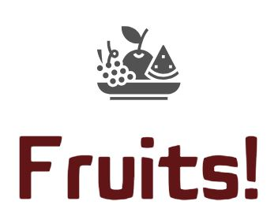

# Conception d'une Architecture Big Data pour la Classification d'Images de Fruits

## Description du Projet

Bienvenue dans le repository GitHub du projet (fictif) "Fruits" ! Une jeune start-up de l'AgriTech se consacre à la préservation de la biodiversité des fruits en développant des robots cueilleurs intelligents. Elle souhaite se faire connaître en proposant une application mobile au grand public. Cette application permettra aux utilisateurs de prendre en photo un fruit et d'obtenir des informations pertinentes sur celui-ci. Elle servira également de première version pour notre moteur de classification d'images de fruits.

## Objectifs du Projet

Les principaux objectifs de ce projet sont les suivants :

1. Mettre en place les premières briques de traitement des images pour notre architecture Big Data en utilisant des outils tels que AWS EMR et PySpark.
2. Fournir une démonstration de l'instance EMR opérationnelle et expliquer en détail le script PySpark.

## Les Données

Nous disposons d'un jeu de données constitué d'images de fruits et des labels associés (en téléchargement direct à ce [lien](https://www.kaggle.com/datasets/moltean/fruits)).

## Spécifications du Projet

Pour la mise en œuvre de l'architecture Big Data, nous utiliserons AWS EMR et PySpark pour profiter d'une plateforme distribuée. Nous compléterons le script PySpark avec deux étapes essentielles :

1. Traitement de diffusion des poids du modèle TensorFlow sur les clusters (broadcast des "weights" du modèle) en nous appuyant sur l'article "Distributed model inference using TensorFlow Keras".
2. Étape de réduction de dimension de type PCA en PySpark.

Nous veillerons à respecter les contraintes du RGPD en paramétrant notre installation pour utiliser des serveurs situés sur le territoire européen.
